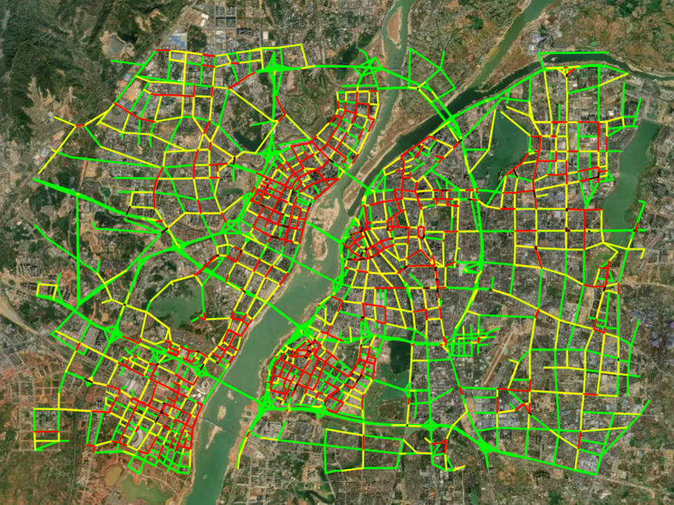
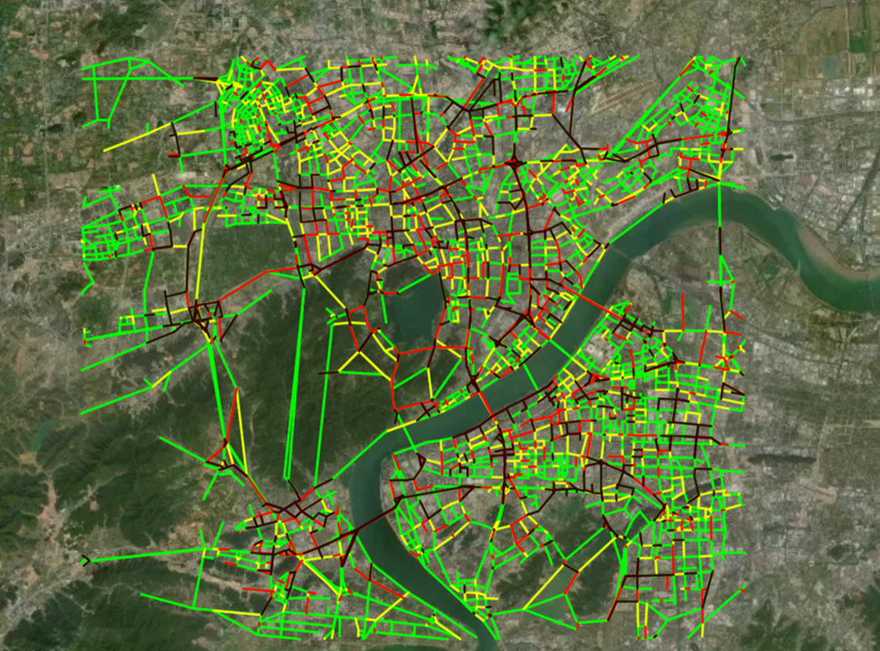
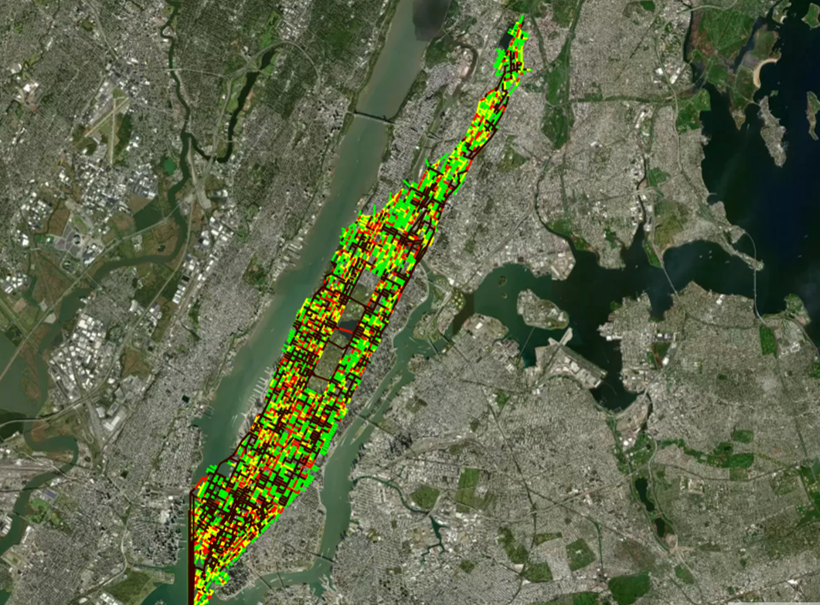

# The data generation process of Hangzhou, Nanchang, Manhattan

## Traffic simulator introduction

The traffic simulator is from [KDDCUP-2021](https://kddcup2021-citybrainchallenge.readthedocs.io/en/latest/APIs.html#simulation-initialization). It offers API functions to query the vehicle information and road traffic state every second. Thus, these API function are utilized to query the data. Then, the traffic information of every traffic-movement is merged in a 1-minute level. For example, the instant vehicle of every traffic-movement every 1-minute is collected, which is the volume used in this paper.

The running example is as follows.

The coverage area of three datasets (Nanchang, Hangzhou, Manhattan) is as follows.

      

## Input data introduction 

See [KDDCUP-2021-doc](https://kddcup2021-citybrainchallenge.readthedocs.io/en/latest/cbengine.html#)
